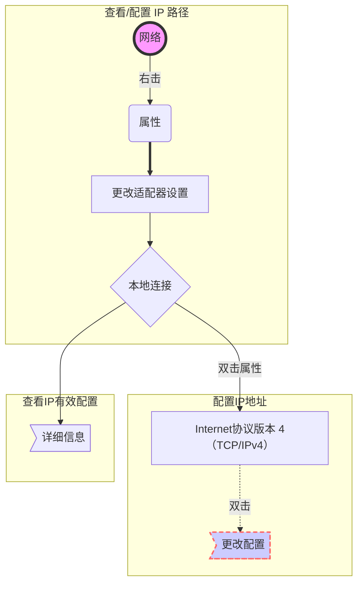

# 云计算系统管理 01

- [云计算介绍](#云计算介绍)
- [TCP/IP 协议及配置](#tcpip-协议及配置)

## 云计算介绍

- [服务器架构](#服务器架构)
  - 什么是服务器
  - 典型服务模式

### 服务器架构

#### 什么是服务器

- 能够为其他计算机提供服务的更高级的电脑
  - 机架式
  - 塔式
  - 机柜式
  - 刀片式

- 服务器的类型尺寸（*Unit*）
  - $1u=1.75英寸=44.45毫米=4.445厘米$
  - $2u=8.89cm$

#### 典型服务模式

- C/S，*Client/Server* 架构
  - 由服务器提供资源或某种功能
  - 客户机使用资源或功能

## TCP/IP 协议及配置

- [TCP/IP 协议](#tcpip-协议)
  - TCP/IP 协议简介
  - IP 地址的概述
- [基本环境配置](#基本环境配置windows-操作系统-tcpip-地址配置)
  - TCP/IP 参数设置
  - 配置 IP 地址
  - 查看 IP 有效配置
  - 用命令查看 IP 有效配置
  - 使用 ping 命令测试网络连通性

### TCP/IP 协议

#### TCP/IP 协议简介

- TCP/IP 是最广泛支持的通信协议集合
  - 包括大量 Internet 应用中的标准协议
  - 支持跨网络架构、跨操作系统平台的通信

##### 主机与主机之间通信的三个要素

- IP 地址（*IP address*）
- 子网掩码（*subnet mask*）
- IP 路由（*IP router*）

#### IP 地址的概述（IPv4 地址）

- 作用：用来标识一个节点的网络地址
- 地址组成（点分十进制）：
  - 一共 32 个二进制数
  - 表示为 4 个十进制数， 以 `.` 隔开
  > 二进制：11001100.01010101.11110000.10101010
  > 十进制：192.168.1.1
  
  $$11111111（二进制） = 255（十进制）$$

##### IP地址的分类

- 判断的依据：只需要查看 IP 地址的第一个十进制数。
  - 网络位：类似身份证号的前6位，用来表示区域
  - 主机位：用来表示在区域中的编号

  @import "src/csv/admin-1-1.csv"

##### 网络名称

- 表示一个网络（区域）的名称规则：网络位不变，主机位全为 0
- 不同网络之间的通讯需要使用路由器设备

##### 子网掩码

- 为计算机表示 IP 地址的网络位与主机位，利用二进制的 1 标识网络位，利用二进制的 0 标识主机位

##### 举例

> 192.168.1.1
> 子网掩码 = 11111111.11111111.11111111.00000000 = 255.255.255.0
> 也可以表示为：192.168.1.1/24（有24个网络位）
> 网络名：192.168.1.0

##### 网关

- 从一个网络连接到另一个网络的“关口”
- 通常是一台路由器，或者防火墙/接入服务器

##### DNS 服务器

- 域名解析[^2]系统，提供域名解析的机器

[^2]:能够将域名解析为 IP 地址

##### 测试网络通信的命令 `ping`

- 格式：`ping 对方的 IP 地址`

### 基本环境配置（Windows 操作系统 TCP/IP 地址配置）

- 基本步骤：
  1. 配置 IP 地址（IPv4）
  2. 配置子网掩码
  3. 配置网关
  4. 配置 DNS 服务器

#### TCP/IP 参数设置

- 方式1：自动获取 IP 地址
  - Windows 默认方式
- 方式2：手动配置 IP 地址
  - 增加管理员负担
  - 容易出错
  - 适合企业内部服务器使用

#### 配置 IP 地址

##### 用命令查看 IP 有效配置

- <kbd>Win</kbd>+<kbd>r</kbd>
- 输入 ***cmd*** 打开命令控制台窗口
- 执行：`ipconfig /all` 可查看当前 IP 地址的详细配置

###### 使用 `ping` 命令测试网络连通性

- 回环测试（`ping 127.0.0.1`）
  - 验证 TCP/IP 协议驱动是否正常
- 本网连通性测试
  - ping 同一网段内其他计算机的 IP 地址
  - ping 默认网关的 IP 地址
- 远程连通性测试
  - ping 位于其他网络内的远程主机
  - 如果此步成功，则前两步的测试均可忽略，否则可依次执行检查
