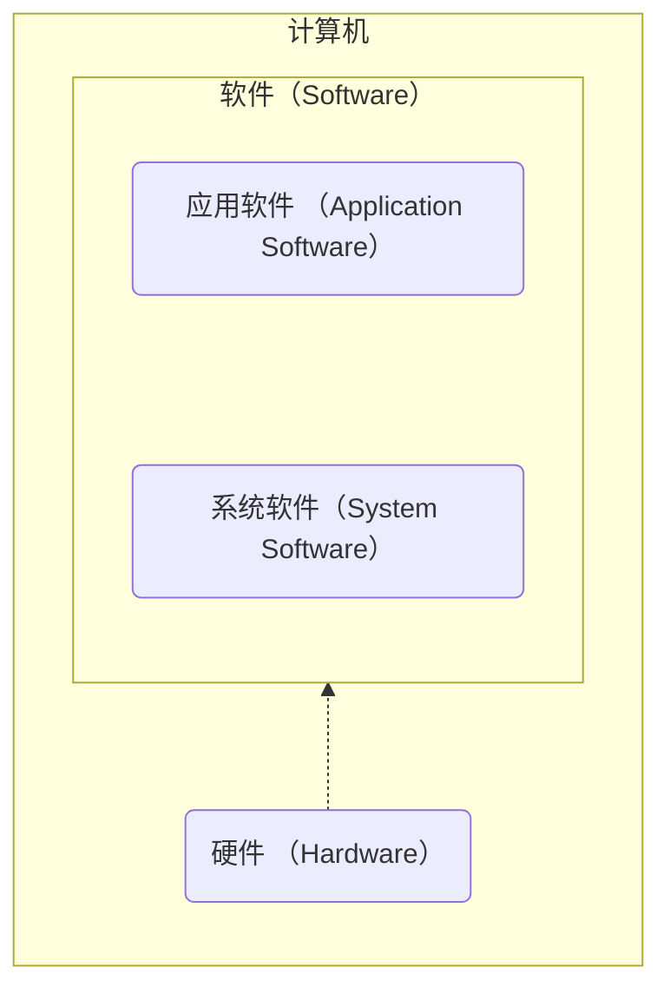
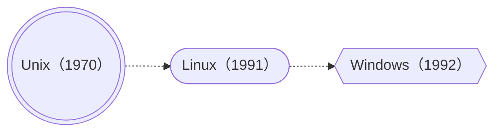

# 云计算系统管理 02

- [Linux 系统简介](#linux-系统简介)
- [安装 Linux 系统](#安装-linux-系统)
- [Linux 基本操作](#linux-基本操作)

## Linux 系统简介

- [什么是 Linux](#什么是-linux)
  - 计算机的组成
  - Linux 是一种操作系统
- [Unix / Linux 发展史](#unix--linux-发展史)
  - Unix 系统发展
  - Linux 的诞生
  - Linux 系统内核
- [Linux 版本及应用](#linux-版本及应用)
  - Linux 发行版本
  - Red Hat 系列版本
  - Linux 在企业中的应用

### 什么是 Linux

#### 计算机的组成



#### Linux 是一种操作系统



### Unix / Linux 发展史

#### Unix 系统发展

- UNIX 诞生
  - *1970 年 1 月 1 日*
  - *Ken Thompson、Dennis Ritchie*
  - *1969 年*根据 MULTICS 项目的经验，开发了操作系统 UNICS，后改为 UNIX
  - *1973 年*，用 C语言 重写了 UNIX
  - *1978 年*，有大约 600 台计算机运行 UNIX

#### Linux 的诞生

- Linux 之父，*Linus Torwalds*
  - *1991 年 10 月*，发布 *0.02* 版（第一个公开版）内核
  - *1994 年 03 月*，发布 *1.0* 版内核

#### Linux 系统内核

- 由 *Linus* 率领的内核项目团队统一发布
  - 内核作用：**管理 CPU/内存、驱动基本硬件、文件系统**
  - 版本号：主版本.次版本.修订号

### Linux 版本及应用

#### Linux 发行版本

- 发行版的 名称/版本 由发行方决定
  - *Red Hat Enterprise Linux 6/7/8/9*
  - *Rocky Linux 8/9*
  - *Suse Linux Enterprise 12*
  - *Debian Linux 7.8*
  - *Ubuntu Linux 22.04*
  - ...

#### Red Hat 系列版本

- 红帽 Linux 企业版
  - 简称 RHEL（*Red Hat Enterprise Linux*）
  - *<http://www.redhat.com/>*
- CentOS 社区企业操作系统
  - *Community Enterprise OPerating System*
  - *<http://www.centos.org/>*

#### Rocky Linux 介绍

- Rocky Linux 是一个开源、免费的企业级操作系统
  - 旨在与 *RHEL（Red Hat Enterprise Linux）* 100% 兼容。它正在社区的密集开发中
- CentOS 的原创始人 *Gregory Kurtzer*（格雷戈里·库尔策）
  - *Rocky Linux 8.3/8.4/8.5/8.6/...*
  - *2022 年 7 月 16 日*发布 *9.0* 版本

#### Linux 在企业中的应用

- 基于Linux的企业服务器
- 嵌入式系统
- 高性能大型运算

## 安装 Linux 系统

- [安装系统](#虚拟机安装-linux-系统)
  - 使用虚拟机软件
  - 安装过程
  - 初始化过程
- [预备知识](#预备知识)
  - Windows 目录结构
  - Linux 目录结构
  - 磁盘表示

### 虚拟机安装 Linux 系统

#### 使用虚拟机软件

- 通过软件来模拟真实计算机的一类软件程序
  - 一台物理机可运行多个虚拟机
  - 每个虚拟机提供一个相对独立的操作系统环境
  - 虚拟机软件：VMware、KVM、...

##### 虚拟机拓扑图

<div align=center>  </div>

#### 安装过程

- 引导计算机从光盘启动，设置并安装系统
  - 选择“Install Rocky Linux 8”
  - 选择“简体中文”
  - 自动分区、带 GUI 的服务器、连接网络
  - 为管理员 root 设置密码
  - 新建一个普通用户

#### 初始化过程

- 接受许可证、确认网络连接
- 创建用户
- ...

#### 拍摄快照

- 关闭系统，拍摄虚拟机快照（还原数据用）

### 预备知识

#### Windows 的目录结构

- 多目录树形结构
  - C盘、D盘、...

#### Linux 的目录结构

- 单目录树形结构
  - 最顶层为根，使用 `/` 表示
- `/` 根目录：Linux 系统的起点（所有的数据存放的目录）
  - 路径：`/abc/1.txt`
    - 在根目录下，有 `abc` 目录，在 `abc` 目录里有 `1.txt` 文件。在 Linux 中一个路径，只有开头的 `/` 才表示为根目录
- Unix/Linux的基本哲学理念：==一切皆文件==

#### 磁盘表示

- 常见的硬盘接口类型：IDE 与 SCSI，NVMe
- 名称规则
  


## Linux 基本操作

- [使用图形桌面](#使用图形桌面)
  - 登录到图形桌面
  - 常见的桌面管理操作
- [命令行基本操作](#命令行基本操作)
  - 获取命令行界面
  - 查看及切换目录
  - 查看文本文件内容
  - 查看 CPU 和内存
  - 查看主机名和 IP 信息
  - 创建文档
  - 文本内容操作
  - 关机及重启操作

### 使用图形桌面

#### 登录到桌面环境

- 以指定的系统用户登录
  - root（超级管理员）
  - 或者，预先创建的普通用户

#### 常见的桌面管理操作

- 打开应用程序、访问文件夹、...

### 命令行基本操作

#### 获取命令行界面

- 活动 --> 终端
  - 点击界面上的活动字样，然后选择终端图标
- 命令行界面字体调节
  - 字体变大：<kbd>ctrl</kbd>+<kbd>shift</kbd>+<kbd>+</kbd>
  - 字体变小：<kbd>ctrl</kbd>+<kbd>-</kbd>
- 命令行提示符
  - `[当前登录的用户@主机名 当前所在的目录]`
  - 以 `#` 结尾表示当前登录的身份为 *root*
  - 以 `$` 结尾表示当前登录的身份为普通用户

#### 查看及切换目录

- `pwd`：Print Working Directory
  - 用途：查看当前工作目录
- `cd`：Change Directory
  - 用途：切换工作目录
  - 格式：`cd 目标文件夹位置`
  > [root@host ~]# `cd /etc/pki/CA/private`[^1]
  > [root@host private]# `pwd`
  > /etc/pki/CA/private
  > [root@host private]# `cd ../../`[^2]
  > [root@host pki]#

[^1]: 以 `/` 开头的是==绝对路径==
[^2]: 以当前目录为参照的是==相对路径==，`..` 表示父目录

- `ls`：List
  - 格式：`ls [目录或文件名]...`

  ```bash
  ls # 列出工作目录内容

  ls / # 列出根目录内容
  ```

#### 查看文本文件内容

- 利用 `cat` 命令检查红帽发行新系

  ```bash
  cat /etc/redhat-release # RHEL 系统

  cat /etc/rocky-release # Rocky 系统
  ```

- `less` 分屏阅读工具
  - 格式：`less 文件名...`
  - 优势：支持上下键滚动

#### 查看 CPU 和内存

```bash
# 列出 CPU 处理器信息
lscpu

# 检查内存大小、空闲情况
cat /proc/meminfo
```

#### 查看主机名和 IP 信息

```bash
# 列出当前系统的主机名称
hostname

# 列出已激活的网卡连接信息（最小安装没有该命令）
ifconfig
```

#### 创建文档

- `mkdir`：Make Directory，创建目录
  - 格式：`mkdir [/路径/]目录名...`
- `touch`：新建空文件
  - 格式：`touch 文件名...`

```bash
mkdir /opt/student
ls /opt

touch /opt/1.txt
ls /opt/
```

#### 文本内容操作

- `head`、`tail` 命令
  - `head -n 数字 文件名`[^3]
  - `tail -n 数字 文件名`

```bash
tail /var/log/messages
```

[^3]:1.未指定行数时，默认输出 10 行
2.选项 `-n 数字` 可以简写为 `-数字`

- grep 工具
  - 用途：输出包含指定字符串的行
  - 格式：`grep '查找条件' 目标文件`

```bash
grep '127.0.0.1' /etc/hosts
```

#### 关机及重启操作

```bash
poweroff # 关机

reboot # 重启
```

## 案例

### Linux 命令行基本操作

#### 简单命令行操作练习

1. `pwd`、`cd`、`ls` 命令练习

    ```bash
    pwd     # 显示当前所在的位置
    cd /    # 切换到根目录下
    pwd
    ls      # 显示当前目录下内容

    cd /boot
    ls

    cd /
    ls

    cd /home
    ls

    cd /root
    ls
    ```

2. `ls` 命令练习

    ```bash
    cd /etc
    pwd
    ls /root    # 查看指定目录内容

    ls /        # 查看根目录内容
    ls /home
    ls /opt
    ls /boot
    ls /var
    ls /bin
    ls /proc
    ls /usr
    ls /tmp
    ls /mnt
    ```

3. 路径练习
   - 绝对路径：以跟开始的路径
   - 相对路径：以当前位置，为参照的路径

    ```bash
    cd /usr/
    ls

    cd games        # 相对路径
    pwd

    cd /
    cd /usr/games/  # 绝对路径
    pwd
    ```

4. 路径切换练习

    ```bash
    # .. 表示上一层目录（父目录）

    cd /etc/pki/rpm-gpg/
    pwd

    cd ..
    pwd

    cd ..
    pwd

    cd ..
    pwd
    ```

5. 颜色：目录为蓝色，文件为黑色（文件的路径书写时必须没有 `/` 结尾）
   `cat` 查看文本文件内容，适合查看内容较少的文件

    ```bash
    ls /root/
    ls /root/anaconda-ks.cfg
    cat /root/anaconda-ks.cfg
    cat /root/initial-setup-ks.cfg
    cat /etc/passwd
    cat /etc/fstab
    cat /etc/group

    cat /etc/redhat-release    # 查看系统版本
    ```

6. `less` 查看文本文件内容，适合查看内容较多的文件

    ```bash
    less /etc/passwd

    # 按上、下键进行滚动
    # 按 q 键进行退出
    ```

7. `hostname` 命令练习

    ```bash
    hostname

    hostname abc.haha.xixi
    hostname

    # 新开一个全新的命令行终端，查看提示符变化
    hostname A.haha.com

    # 新开一个全新的命令行终端，查看提示符变化
    hostname
    ```

8. 显示 CPU 与内存

    ```bash
    # 列出 CPU 处理器信息
    lscpu

    # 列出内存信息
    cat /proc/meminfo
    ```

9. 查看 IP 地址

    ```bash
    ifconfig
    # lo 为本机回环接口（此接口专门用于测试），IP 永远为 127.0.0.1，永远代表本机

    ifconfig eth0 192.168.4.1   # 临时设置 IP

    ifconfig eth0
    ping 192.168.4.1    # Ctrl+c：结束正在运行的命令
    ```

10. 创建数据

    ```bash
    # mkdir 创建目录
    mkdir /opt/test
    ls /opt/
    mkdir /root/test1
    ls /root/

    # touch 创建文本文件
    touch /opt/1.txt
    ls /opt/
    touch /opt/2.txt
    ls /opt/
    ```

11. 查看部分内容

    ```bash
    head -1 /etc/passwd
    head -2 /etc/passwd
    head -3 /etc/passwd

    tail -1 /etc/passwd
    tail -2 /etc/passwd
    tail -3 /etc/passwd
    ```

12. 过滤文件内容

    ```bash
    # 作用：输出包含指定字符串的行
    grep root /etc/passwd
    grep bash /etc/passwd
    grep lisi /etc/passwd
    grep stu /etc/passwd
    grep student /etc/passwd
    ```

13. `vim` 文本编辑器
    三个模式：命令模式、插入模式、末行模式
    vim 当文件不存在时，会自动创建此文件，但是不能创建目录

    ```bash
    vim /opt/haxi.txt
    ```

    ```mermaid
    graph TB
    A[命令模式]
    B[插入模式]
    C[末行模式]
    A -->|"i、a 或 o"| B
    B -->|Esc| A
    C -->|Esc| A
    A -->|:| C
    ```

    - 末行模式：`:wq` 保存并退出
    - 末行模式：`q!`  强制不保存并退出

14. 重启与关闭系统

  ```bash
  reboot # 重启

  poweroff # 关机
  ```
