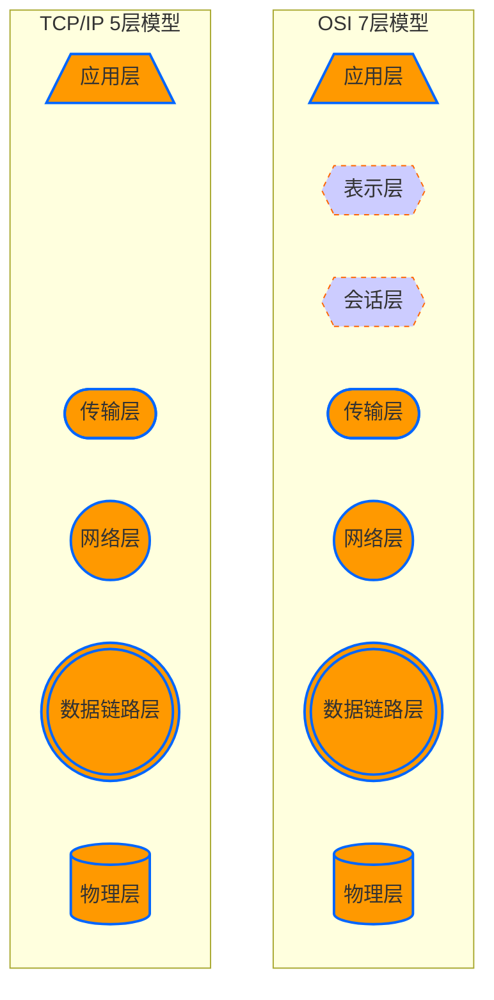
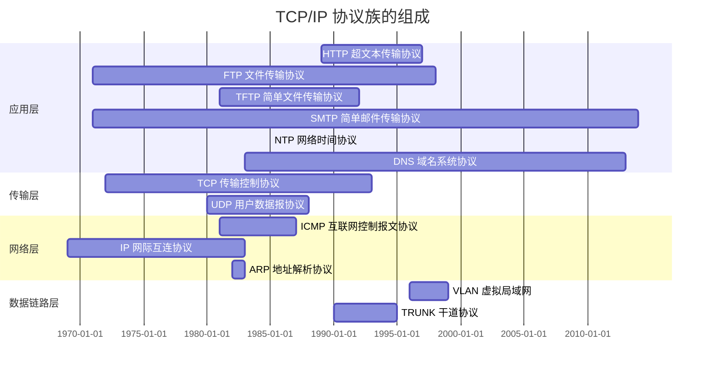
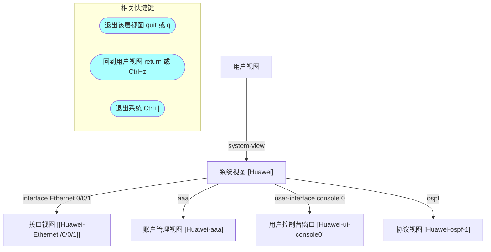
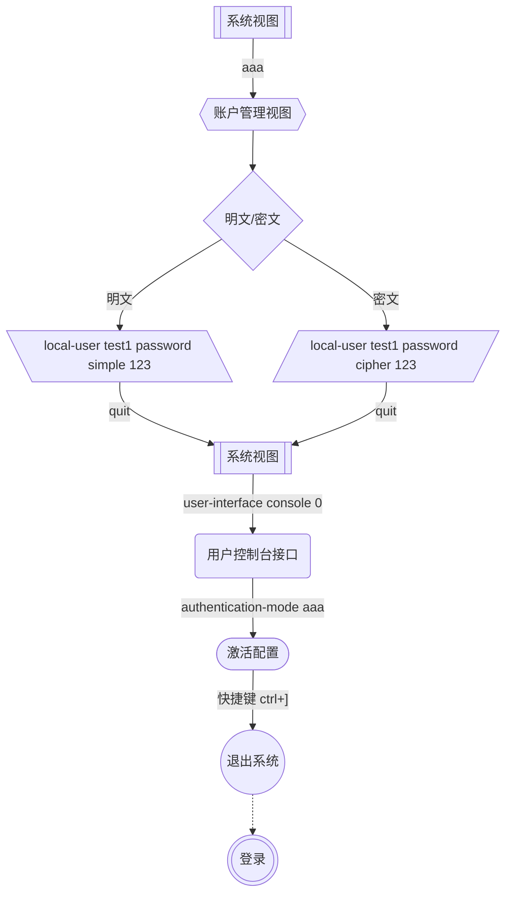

# 企业级网络架构 01

- 了解网络功能与网络发展历程
- 学习网络参考模型
- 掌握交换机基本操作命令
- 学习交换机工作原理并验证

## 计算机网络

- 计算机网络概述
  - 什么是计算机网络
  - 网络与云计算
  - 计算机网络发展阶段
  - 网络标准
  - WAN 与 LAN
- 网络设备及拓扑
  - 网络设备生产厂商
  - 路由交换设备
  - 网络拓扑结构

### 计算机网络概述

#### 什么是计算机网络

- 概念
  - 硬件方面：通过线缆将网络设备和计算机连接起来
  - 软件方面：操作系统，应用软件，应用程序通过通信线路互连
- 实现**资源共享、信息传递**、==增加可靠性、提高系统处理能力==

#### 网络与云计算

- 网络与云计算密不可分

  

#### 计算机网络发展阶段

- 60 年代
  - 分组交换
- 70-80 年代
  - TCP/IP
- 90 年代后
  - Web 技术

#### 网络标准

- 标准化组织
  - 国际标准化组织（International Organization for Standardization，**ISO**）

#### WAN 与 LAN

- 广域网（**W**ide-**A**rea **N**etwork，WAN）
  - 范围：几十到几千千米
  - 作用：用于连接远距离计算机网络
  - 典型应用：Internet
- 局域网（**L**ocal-**A**rea **N**etwork，LAN）
  - 范围：1 千米左右
  - 作用：用于连接较短距离内计算机
  - 典型应用：企业网、校园网

### 网络设备及拓扑

#### 网络设备生产厂商

- 网络设备生产厂商
  - 华为
  - Cisco（思科）

#### 路由交换设备

  

#### 网络拓扑结构

- 线缆连接计算机和网络设备的布局
  - 星型
    
  

  - 网状
  
  

结构 | 优点 | 缺点
-- | -- | --
星型拓扑结构 | 易于实现、易于网络扩展、易于故障排查 | 可靠性低
网状拓扑结构 | 高可靠 | 组网成本高

## 网络通信参考模型

- OSI 参考模型
  - OSI 七层模型
- TCP/IP 模型
  - OSI 模型、TCP/IP 模型
  - TCP/IP 协议族的组成
  - 什么是协议
  - 协议数据单元（PDU）
  - 设备与层的对应关系

### OSI 参考模型

#### OSI 七层模型

- 分层思想
  - 将复杂的流程分解，复杂问题简单化
  - 更容易发现问题并针对性的解决问题
- OSI 参考模型
  - 国际标准化组织（ISO）于 1984 年颁布了**开放系统互连**（Open System Interconnect，OSI）参考模型，从下往上依次是：物理层、数据链路层、网络层、传输层、会话层、表示层、和应用层

### TCP/IP 模型

#### OSI 模型、TCP/IP 模型

- TCP/IP 五层模型、OSI 七层模型

#### TCP/IP 协议族的组成

#### 什么是协议

- 为了使数据可以在网络上从源传递到目的地，网络上所有设备需要“讲”相同的“语言”
- 描述网络通信中“语言”规范的一组规则就是协议

#### 协议数据单元（Protocol Data Unit，PDU）

  

  

#### 设备与层的对应关系

  

## 交换机命令行

- eNSP 软件
  - eNSP 软件简介
  - eNSP 软件使用
- 交换机命令行视图
  - 交换机的命令行视图
  - 命令行的层次关系
  - 视图间的转换

### eNSP 软件

#### eNSP 软件简介

- eNSP 是图形化网络仿真平台
  - 该平台通过对真实网络设备的仿真模拟，帮助广大 ICT 从业者和客户快速熟悉华为数通系列产品，了解并掌握相关产品的操作和配置、提升对企业 ICT 网络的规划、建设、运维能力，从而帮助企业构建更高效、更优质的企业 ICT 网络

#### eNSP 安装

1. 下载并点击软件安装包
2. 安装路径建议不修改
3. 选择安装其他程序：
   - 第一个 WinPcap 与第三个是必需的，但最近 virtualbox5.1.24 版本发现 BUG，可以不安装这个版本，直接下载 5.2.44 版本：[下载地址](https://download.virtualbox.org/virtualbox/5.2.44/VirtualBox-5.2.44-139)
4. 运行 eNSP 即可使用，注意：在 eNSP 运行过程中弹出的防火墙放行的提示都要点“允许访问”，否则软件无法正常工作。
5. 安装完成后可以打开放入一个 AR2220 路由器测试，右键路由器点启动，然后双击路由器打开命令行界面，等待片刻后看到 `<Huawei>` 字样说明软件正常。

#### eNSP 软件使用

- 模拟器开启界面
  
  

- 硬件设备
  - 在界面的左边区域，这里有许多种类的硬件设备，如路由器、交换机、设备之间的连线，终端设备等
- 设备连线
  - 用鼠标点一下线缆（闪电符号），在右边可以看到各种类型的线，如常用的 Auto（自动连接线）、Copper（手动连接线）
- 设置选项
  - 点击右上角的齿轮按钮可以设置界面、字体等

### 交换机命令行视图

#### 交换机的命令行视图

---

- 真实的网络设备使用 console 接口，与电脑进行连接，然后使用电脑对该设备进行配置

#### 命令行的层次关系

- 用户视图 —— 查看运行状态或其他参数
  - 系统视图 —— 配置设备的系统参数等
    - 接口视图 —— 配置接口参数
      - 协议视图 —— 配置路由协议

## 交换机命令行配置

- 交换机基本配置
  - 配置主机名
  - 显示 VRP 版本
  - 查看交换机配置
  - 使用账户和密码登录终端
  - 保存交换机的配置
  - 恢复设备出场默认值
- 使用技巧
  - 避免自动退出配置界面

### 交换机基本配置

#### 配置主机名

1. 进入系统视图
2. 输入 `sysname 主机名`
   如：`system sw1`

#### 显示 VRP 版本号

- `display version`

#### 查看交换机配置

- `display current-configuration`

#### 使用账户和密码登录终端

#### 保存交换机的配置

1. 进入用户视图
2. 输入 `save`
3. 输入 y

#### 恢复设备出场默认值

1. 进入用户视图
2. 输入 `reset saved-configuration`
3. 输入 y
4. reboot
5. 三次输入 y

#### 交换机的基本配置

视图 | 命令 | 简写 | 说明
-- | -- | -- | --
`<Huawei>` | `system-view` | `sy` | 切换到系统视图
`[Huawei]` | `sysname sw1` | `sy sw1` | 修改设备名
`[Huawei]` | `undo info-center enable` | `un in e` | 关闭日志显示
`[Huawei]` | `aaa` | `aa` | 进入到账户管理视图
`[Huawei-aaa]` | `local-user u1 password simple\|cipher 123` | `l u1 p s\|c 123` | 创建/修改本机账户 u1，密码（明文\|密文） 123
`[Huawei]` | `user-interface console 0` | `user-i co 0` | 进入用户控制窗口
`[Huawei-ui-console0]` | `authentication-mode aaa` | `a aa` | 激活账户配置
`[Huawei]` | `interface Ethernet 0/0/1` | `i e0/0/1` | 切换到接口视图[^1]
`[Huawei-E0/0/1]` | `ospf` || 切换到协议视图
任意视图 | `display [version\|current-configuration\| mac-address]` || 显示（版本\|全部配置\|MAC地址表）信息
`<Huawei>` | `save` | `sa` | 保存配置
`<Huawei>` | `reboot` || 重启

[^1]: interface：接口
Ethernet：接口类型
0/0/1：接口号

- 华为交换机的命令行
  - `<Huawei>` 用户视图
    - `[Huawei]` 系统视图
      - `[Huawei-aaa]` 账户管理视图
      - `[Huawei-ui-console0]` 用户控制台窗口视图
  - `?` 显示帮助信息
  - <kbd>Tab</kbd> 补全
  - <kbd>Ctrl</kbd>+<kbd>z</kbd> 回到用户视图
  - <kbd>Ctrl</kbd>+<kbd>]</kbd> 退出系统

### 使用技巧

#### 避免自动退出配置界面

- 空闲一段时间后（默认控制台会话时间为 10 分钟），重回初始界面
- 解决方法
  - 配置控制台会话时间

视图 | 命令 | 简写 | 说明
-- | -- | -- | --
系统视图 | `user-interface current` || 进入当前用户的控制台视图
用户控制台视图 | `idle-timeout 100` || 设置控制台会话时间

## 数据链路层解析

- 数据链路层
  - 以太网 MAC 地址
  - 以太网帧格式
- 以太网交换机
  - 什么是交换机
  - 交换机的工作原理
  - 查看 MAC 地址表
  - 交换机的工作原理案例

### 数据链路层

#### 以太网 MAC 地址

- 用来识别一个以太网上的某个单独的设备或一组设备

ip 地址需要在使用时自定义，而 MAC 地址（物理地址或硬件地址），不需要自定义，设备出场时会携带
ip 地址使用十进制，而 MAC 地址使用十六进制，用来标识设备的唯一性，通常不可修改，全球唯一

  

#### 以太网帧格式

- 数据链路层的协议数据单元
- 格式：==[目的地址|源地址|类型|数据|帧校验序列]==

### 以太网交换机

#### 什么是交换机

- 交换机是用来连接局域网的主要设备
  - 交换机能够根据以太网帧中目标地址智能的转发数据，因此交换机工作在数据链路层
- 交换机的转发原理
  - **学习**：MAC 地址表是交换机通过学习接收的数据帧的源 MAC 地址来形成的
  - **广播**：如果目标地址在 MAC 地址表中没有，交换机就向除接收到该数据帧的接口外的其他所有接口广播该数据帧
  - **转发**：交换机根据 MAC 地址表单播转发数据帧
  - **更新**：交换机 MAC 地址表的老化时间是 300 秒；交换机如果发现一个帧的入接口和 MAC 地址表中源 MAC 地址的所在接口不同，交换机将 MAC 地址重新**学习**到新的接口

#### 查看 MAC 地址表

- 输入 `display mac-address`

#### 交换机的工作原理案例

  

---

  

- 交换机 SW1 在接收到数据帧后，执行以下操作：
  - 交换机 SW1 查找 MAC 地址表
  - 交换机 SW1 学习主机 11 的 MAC 地址
  - 交换机 SW1 向除接收接口外其他所有接口发送广播

---

  

---

  

- 交换机 SW2 在接收到数据帧后，执行以下操作：
  - 交换机 SW2 查看 MAC 地址表
  - 交换机 SW2 学习源 MAC 地址和接口号
  - 交换机 SW2 向除接收接口以外的所有接口广播数据帧
- 主机 22，查看数据帧的目标 MAC 地址不是自己，丢弃

---

  

---

  

---

  

- 交换机 SW2 在接收到数据帧后，执行以下操作：
  - 交换机 SW2 学习源 MAC 地址和接口号
  - 交换机 SW2 查看 MAC 地址表，根据 MAC 地址表中的条目，单播转发数据到接口 3

---

  

- 交换机 SW1 在接收到数据帧后，执行以下操作：
  - 交换机 SW1 学习源 MAC 地址和接口号
  - 交换机 SW1 查看 MAC 地址表，根据 MAC 地址表中的条目，单播转发数据到接口 1
- 主机 11，收到数据帧

---

- 交换机最终的 MAC 地址表（全网互通后）

  

