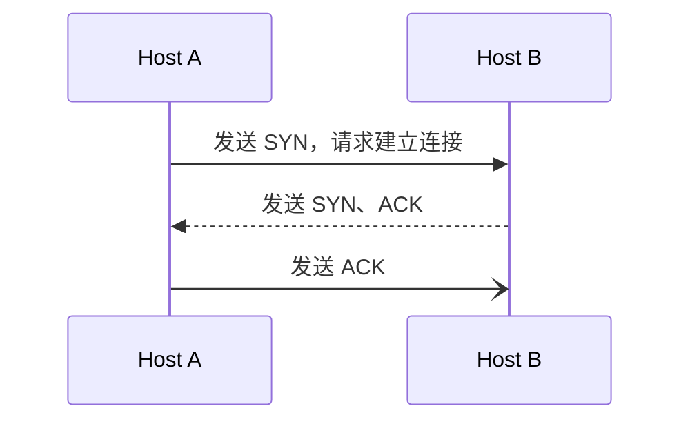
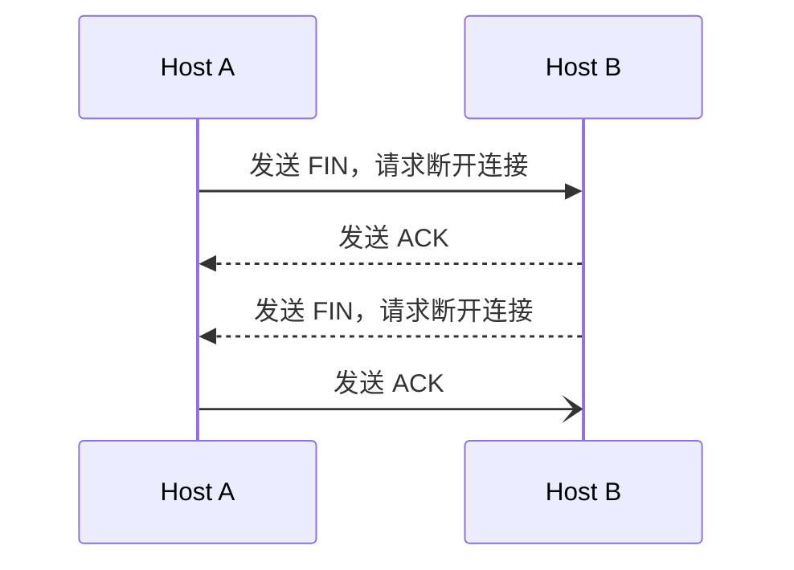

# 企业级网络架构 03

- 会使用三层交换机
- 使用 OSPF 连接网络
- 传输层解析
- ACL 原理与应用

## 三层交换机

- 桑层交换机概述
  - 什么是三层交换机
  - 虚拟接口概述

### 三层交换机概述

#### 什么是三层交换机

- $三层交换 = 二层交换 + 三层转发（路由）$

  

#### 虚拟接口概述

- 在三层交换机上配置的 VLAN 接口为虚拟接口
- 使用 Vlanif（VLAN 虚拟接口）实现 VLAN 间路由
  - VLAN 接口的引入使得应用更加灵活

| 视图     | 命令                 | 简写   | 说明                 |
| -------- | -------------------- | ------ | -------------------- |
| 系统视图 | `interface Vlanif 3` | `i v3` | 创建（打开）虚拟接口 |

---

  

#### 三层交换配置

- 确定哪些 VLAN 需要配置
- 如果三层交换机上没有该 VLAN 则创建它
- 给每个 VLAN 虚拟接口配置 IP 地址
- 如果需要，为三层交换机添加路由

## OSPF

- 动态路由
  - 动态路由概述
  - 动态路由协议 OSPF
- 使用动态路由
  - OSPF 基本配置

### 动态路由

#### 动态路由概述

- 动态陆游
  - 给予某种路由协议实现
- 动态路由特点
  - 减少了管理人物

---

  

---

  

---

  

---

  

#### 动态路由协议 OSPF

- 全称 Open Shortest Path First（开放式最短路径优先）
- 适合大中型网络使用
- OSPF 区域（area）
  - 为了适应大型的网络，OSPF 可以在网络内部划分多个区域
- 区域 0
  - ospf 使用的第一个区域的 ID 号

### 使用动态路由

#### OSPF 基本配置

- 启动 OSPF 路由进程并进入首个区域
  - 系统视图：`ospf 1`
  - ospf 视图：`area 0`
- 宣告所在的网段
  - ospf 区域视图：`network 192.168.0.0 0.0.0.255`

视图 | 命令 | 简写 | 说明
-- | -- | -- | --
系统视图 | `ospf 1` | `ospf` | 启动 OSPF 路由
ospf 视图 | `area 0` | `a 0` | 进入区域（0 为第一个区域，表示开始使用 ospf）
ospf 区域视图 | `network 192.168.1.0 0.0.0.255` | `n 192.168.1.0 0.0.0.255` | 宣告自身所直连的网段（最后为反掩码）

#### 案例：使用动态路由连接网络

需求
: 配置动态路由协议 ospf 使全网互通

  

## 默认路由

- 概述与配置
  - 默认路由概述
  - 配置

### 概述与配置

#### 默认路由概述

- 默认路由是一种特殊的静态路由
- 默认路由的目标网络为 `0.0.0.0 0.0.0.0`，可匹配任何目标地址
- 只有当从路由表中找不到任何明确匹配的路由条目时，才会使用默认路由，一般访问公网时使用

#### 配置

- 默认路由语法与静态路由类似
- 格式
  - 系统视图：`ip route-static 0.0.0.0 0 下一跳`

## 传输层

- 传输层概述
  - 传输层的作用
  - 传输层的协议
- TCP 协议
  - TCP 的封装格式
  - TCP 的连接与断开
  - TCP 的应用
- UDP 协议
  - UDP 的封装格式
  - UDP 的应用

### 传输层概述

#### 传输层的作用

- 网络层提供点到点的连接
- 传输层提供端到端的连接
  - 定义了端口号 0~65535

#### 传输层的协议

- TCP（Transmission Control Protocol）
  : 传输控制协议
  - 可靠的、面向连接的协议
  - 传输效率低
- UDP（User Datagram Protocol）
  : 用户数据报协议
  - 不可靠的、无连接的服务
  - 传输效率高

### TCP 协议

#### TCP 的封装格式

  

#### TCP 的连接与断开

- TCP 的三次握手

---

- TCP 的四次断开

#### TCP 的应用

端口 | 协议 | 说明
-- | -- | --
21 | FTP | 文件传输协议，用于上传下载
22 | SSH | 用于远程登录，管理网络设备
25 | SMTP | 简单邮件传输协议，用于发送邮件
53 | DNS | 域名服务
80 | HTTP | 超文本传输协议
443 | HTTPS | 超文本传输协议，附带安全加密功能

### UDP 协议

#### UDP 的封装格式

  

#### UDP 的应用

端口 | 协议 | 说明
-- | -- | --
69 | TFTP | 简单文件传输协议
53 | DNS | 域名服务
123 | NTP | 网络时间协议

## ACL

- 访问控制列表概述
  - ACL 的作用
  - ACL 的主要类型
  - ACL 规则
- 基本 ACL
  - 基本 ACL 概述
  - 基本 ACL 的配置案例

### 访问控制列表概述

#### ACL 的作用

- 访问控制列表（Access Control List，ACL）是应用在路由器接口的指令列表（即规则）

  

- 读取第三层、第四层报文头信息
- 根据预先定义好的规则对报文进行过滤

  

#### ACL 的主要类型

分类 | 编号范围 | 参数
-- | -- | --
基本 ACL | ==2000~2999== | 源 IP 地址
高级 ACL | ==3000~3999== | 源 IP 地址、目的IP 地址、端口、协议

#### ACL 规则

- 每个 ACL 可以包含多个规则，路由器根据规则对数据流量进行过滤

  

### 基本 ACL

#### 基本 ACL 概述

- 基本 ACL
  : 基于源IP地址过滤数据包
  - 列表号是 ==2000~2999==

#### 基本 ACL 的配置命令

视图 | 命令 | 简写 | 说明
-- | -- | -- | --
系统视图 | `acl 2000` | `a 2000` | 进入 ACL 视图
ACL 视图 | `rule deny\|permit source [192.168.2.1 [0.0.0.0\|0]\|any]` | `r d\|p s [...]` | 创建规则，（拒绝\|允许）该源地址的数据通过（最后是反掩码）
ACL 视图 | `undo rule 5` | `un r 5` | 删除 ACL 规则
接口视图 | `traffic-filter inbound\|outbound acl 2000` | `traffic-f i\|o a 2000` | 定义过滤数据是（入\|出）方向，并应用之前创建的 acl2000 规则
接口视图 | `undo traffic-filter inbound\|outbound` | `u traffic-f i\|o` | 删除 ACL 规则
任意视图 | `display acl [2000\|all]` | `d acl [a\|2000]` | 查看 ACL 规则

#### 案例：基本 ACL 的配置

需求
  : 禁止主机 PC2 与 PC1 通信，而允许所有其他的流量

  

---

需求
: 允许主机 pc2 与 pc1 互通，而禁止其他设备访问 pc1

  

