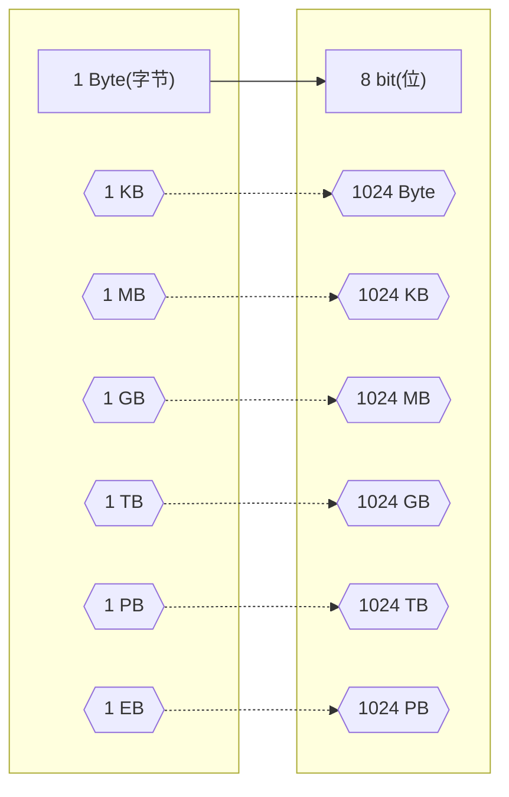

# 企业级网络架构 05

- 数制
- ipv4 地址扩展应用
- 了解 ipv6 地址
- Linux 虚拟网络

## 数制

- 数制介绍
  - 带宽
  - 存储量
  - 常用的数制
  - 数制的表示方法
- 数制转换
  - 数制的计算

### 数制介绍

#### 带宽

- 在一定时间内通过某一网络连接的信息量
- 基本单位：$比特每秒（bit/s）$
- 在计算机软件方面用字节每秒为单位

| 带宽单位     | 缩写     | 等价换算                      |
| ------------ | -------- | ----------------------------- |
| $比特每秒$   | $bit/s$  | $1bit/s=带宽基本单位$         |
| $千比特每秒$ | $kbit/s$ | $1kbit/s=1000bit/s=10^3bit/s$ |
| $兆比特每秒$ | $Mbit/s$ | $1Mbit/s=10^6bit/s$           |
| $吉比特每秒$ | $Gbit/s$ | $1Gbit/s=10^9bit/s$           |

#### 存储量

- 计算机存储量可以用位和字节计量

#### 常用的数制

- 数制
  : 计数的方法，指用一组固定的符号和统一的规则来表示数制的方法
- 计算机常用的数制有二进制、八进制、十进制、十六进制

#### 数制的表示方法

| 数制     | 表示符号                                                                                                                                                                                                       |
| -------- | -------------------------------------------------------------------------------------------------------------------------------------------------------------------------------------------------------------- |
| 二进制   | <Kbd>0</kbd> <Kbd>1</kbd>                                                                                                                                                                                      |
| 八进制   | <Kbd>0</kbd> <Kbd>1</kbd> <Kbd>2</kbd> <Kbd>3</kbd> <Kbd>4</kbd> <Kbd>5</kbd> <Kbd>6</kbd> <Kbd>7</kbd>                                                                                                        |
| 十进制   | <Kbd>0</kbd> <Kbd>1</kbd> <Kbd>2</kbd> <Kbd>3</kbd> <Kbd>4</kbd> <Kbd>5</kbd> <Kbd>6</kbd> <Kbd>7</kbd><Kbd>8</kbd> <Kbd>9</kbd>                                                                               |
| 十六进制 | <Kbd>0</kbd> <Kbd>1</kbd> <Kbd>2</kbd> <Kbd>3</kbd> <Kbd>4</kbd> <Kbd>5</kbd> <Kbd>6</kbd> <Kbd>7</kbd><Kbd>8</kbd> <Kbd>9</kbd> <Kbd>A</kbd> <Kbd>B</kbd> <Kbd>C</kbd> <Kbd>D</kbd> <Kbd>E</kbd> <Kbd>F</kbd> |

### 数制转换

#### 数制的计算

##### 二进制转十进制

- 假设有二进制数：
  $d_{n-1}...d_3d_2d_1d_0$
- 转为十进制数：
  $decimal = d_0\times2^0 + d_1\times2^1 + d_2\times2^2 + ...$

<table><tbody>
  <tr>
    <th>2 的幂</th>
      <td>27</td>
      <td>26</td>
      <td>25</td>
      <td>24</td>
      <td>23</td>
      <td>22</td>
      <td>21</td>
      <td>20</td>
  </tr>
  <tr>
    <th>十进制数</th>
    <td>128</td>
    <td>64</td>
    <td>32</td>
    <td>16</td>
    <td>8</td>
    <td>4</td>
    <td>2</td>
    <td>1</td>
  </tr>
</tbody></table>

实例
: 计算二进制数 $(111001)_2$ 对应的十进制数

$111001_2 = 1\times2^5+1\times2^4+1\times2^3+0\times2^2+0\times2^1+1\times2^0 = 57_{10}$

##### 十进制转二进制

- 除 2 取余法
  - 除2取余，逆序排列

##### 其他进制

## IPv4 地址扩展应用

- 子网划分
  - 子网划分的原因
  - 子网划分的理解
  - 企业应用

### 子网划分

#### 子网划分的原因

- 满足不同网络对 IP 地址的需求
- 节省 IP 地址

#### 子网划分的理解

  

- 将 192.168.1.0/24 划分为 4 个小网段
  - 将主机位划到网络位

  

| 可能的网段    | 每段可用的 IP 地址是(首) | 每段可用的 IP 地址是(尾) |
| ------------- | ------------------------ | ------------------------ |
| 192.168.1.0   | 192.168.1.1              | 192.168.1.62             |
| 192.168.1.64  | 192.168.1.65             | 192.168.1.126            |
| 192.168.1.128 | 192.168.1.129            | 192.168.1.190            |
| 192.168.1.192 | 192.168.1.193            | 192.168.1.254            |

- IP 地址经过一次子网划分后，被分成三个部分——==网络位、子网位、主机位==

- 子网掩码及相关参数对应表
  
  | 子网掩码 | 子网数 | 主机数 | 可用主机数 |
  | -------- | ------ | ------ | ---------- |
  | /25      | 2128   | 126    | 124        |
  | /26      | 4      | 64     | 62         |
  | /27      | 8      | 32     | 30         |
  | /28      | 16     | 16     | 14         |
  | /29      | 32     | 8      | 6          |
  | /30      | 64     | 4      | 2          |

#### 企业应用

  

#### 案例：子网划分为 4 个网段

需求
: 将 192.168.1.0/24 划分为 4 个网段，并应用在下列拓扑中
  
  

## IPv6

- IPv6 地址
  - IPv6 简介
  - IPv6 的优势
- 配置与使用
  - IPv6 地址格式
  - 网络设备开启 IPv6

### IPv6 地址

#### IPv6 简介

- 互联网通信协议第 6 版（Internet Protocol version 6，IPv6）是互联网协议的最新版本
- 旨在解决 IPv4 地址枯竭问题

#### IPv6 的优势

- IPv6 具有更大的地址空间
  - IPv4 长 32 位，最大地址个数为 $2^{32}$，使用==点分十进制==
  - IPv6 长 128 位，最大地址个数为 $2^{128}$，使用==冒分十六进制==

### 配置与使用

#### IPv6 地址格式

- 首选格式
  - IPv6 的 128 位地址格式被分成 8 段，每 16 位为一段，每段转换为十六进制数，并用冒号隔开
  例如：*2001:0001:0000:0002:0000:0000:0000:45ff*
- 压缩表示
  - 去掉不必要的 0
    *2001:1:0:2:0:0:0:45ff*
  - `::` 表示多个连续的 0（`::` 在整个地址中只能出现一次）
    *2001:1:0:2::45ff*

- 特殊地址（special address）
  - 环回地址：*::1*，相当于 IPv4 的 *127.0.0.1*

#### 网络设备开启 IPv6

- 由于目前大部分设备默认支持的是 IPv4，存在无法直接使用 IPv6 的情况，此时需要通过配置开启 IPv6 功能
- 网络设备支持 IPv6 的方法如下
  1. 首先在系统视图启动 IPv6 支持：`ipv6`
  2. 在接口开启 IPv6 功能（`IPv6 enable`）并通过 `IPv6 address` 命令配置地址

## Linux 虚拟网络

- 虚拟网络
  - 虚拟互联网
- 环境配置
  - KVM 配置
  - Workstation 配置

### 虚拟网络

#### 虚拟机互连

- 真实设备可以用交换机实现互连
- 而虚拟机无法直接使用交换机互连

---

- 在虚拟机环境中可以使用虚拟网络
- 虚拟网络可以虚拟出交换机的效果连接所有虚拟机
- 如果需要，可以创建多个虚拟交换机

### 环境配置

#### KVM 配置

- 打开 KVM 虚拟系统管理器，找到连接详情里的虚拟网络后
  可以根据需求对虚拟网络进行添加、删除等操作

#### Workstation 配置

- 打开菜单中的虚拟网络编辑器，可以根据需求添加或者移除虚拟网络

#### 案例：利用虚拟网络连接虚拟机

- 创建 *192.168.66.0* 网段的虚拟网络
- 为虚拟机新添加网卡并加入上述虚拟网络
