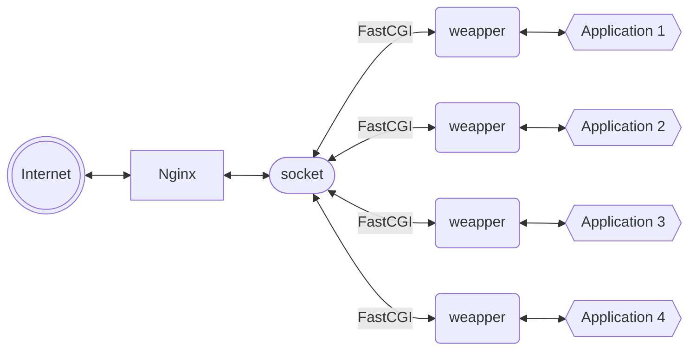

# Linux 高级运维

- [部署 LNMP](#部署-lnmp)
- [Nginx + FastCGI](#nginx--fastcgi)
- [Nginx 高级技术](#nginx-高级技术)

## 部署 LNMP

- [LNMP 基础知识](#lnmp-基础知识)
  - 什么是 LNMP
- [LNMP 安装](#lnmp-安装)
  - 安装 Nginx
  - 安装 MariaDB
  - 安装 PHP
  - 安装 PHP 扩展
  - 启动服务

### LNMP 基础知识

#### 什么是 LNMP

- 主流的企业网站平台之一
  - <font color=red>L</font>：Linux 操作系统
  - <font color=red>N</font>：Nginx 网站服务软件
  - <font color=red>M</font>：MySQL、MariaDB 数据库
  - <font color=red>P</font>：网站开发语言（PHP、Python）

### LNMP 安装

- 安装 Nginx

  ```bash
  tar -zxvf nginx-1.22.1.tar.gz
  cd nginx-1.22.1
  ./configure --prefix=/usr/local/nginx --user=nginx --group=nginx --with-http_ssl_module
  make && make install
  useradd nginx -s /sbin/nologin
  ```

- 安装 MariaDB
  
  ```bash
  yum -y install mariadb mariadb-server mariadb-devel
  ```

- 安装 PHP
  
  ```bash
  yum -y install php
  yum -y install php-fpm
  ```

- 安装 PHP 扩展
  - 给 PHP 安装扩展库文件，使得 PHP 可以连接 MariaBD 数据库

  ```bash
  yum -y install php-mysqlnd
  ```

- 启动服务
  
  ```bash
  # 启动 Nginx 服务
  /usr/local/nginx/sbin/nginx
  ss --ntulp | grep :80

  # 启动 MySQL 服务
  systemctl enable mariadb --now
  ss -utnalp | grep :3306

  # 启动 PHP 服务
  systemctl enable php-fpm --now
  systemctl status php-fpm
  ```

## Nginx + FastCGI

- [FastCGI](#fastcgi)
  - FastCGI 工作原理
  - FastCGI 简介
  - FastCGI 缺点
  - 配置 FastCGI
- [LNMP 安装](#nginx)
  - 编辑 nginx.conf
  - 测试

### FastCGI

#### FastCGI 工作原理



- 工作流程
  1. Web Server 启动时载入 FastCGI 进程管理器
  2. FastCGI 进程管理器初始化，启动多个解释器进程
  3. 当客户端请求到达 Web Server 时，FastCGI 进程管理器选择并连接到一个解释器
  4. FastCGI 子进程完成处理后返回结果，将标准输出和错误信息从同一连接返回 Web Server

  

#### FastCGI 简介

- FastCGI 技术目前支持的语言
  - *PHP、C/C++、Java、Perl、Python、Ruby*

#### FastCGI 缺点

- 内存消耗大
  - 因为是多进程，所以进程消耗更多的服务器内存，PHP-CGI 解释器每进程消耗 7M-25M 内存，将这个数字乘以 50 或 100 就是很大的内存数
  - Nginx + PHP（FastCGI）服务器在 3 万并发连接下
    开 10 个 Nginx 进程消耗 150M 内存（$10×15M$）
    开 64 个 php-cgi 进程消耗 1280M 内存（$20M×64$）

#### 配置 FastCGI

- php-fpm 的配置文件可定义两种连接方式
  - 配置文件：*/etc/php-fpm.d/www.conf*

  ```bash
  [www]
  listen = 127.0.0.1:9000
  # 或
  #listen = /run/php-fpm/www.sock
  ```

- FastCGI 配置进程开启数
  
  ```bash
  pm.max_children = 50
  pm.start_servers = 5
  ```

### Nginx

#### 编辑 nginx.conf

- 配置文件：*/usr/local/nginx/conf/nginx.conf*

  ```bash
  location / {
      root html;
      index index.php index.html index.thm;
  }
  location ~ \.php$ { # ~ 支持正则
      root html;
      
      fastcgi_pass 127.0.0.1:9000; # php-fpm 的 IP 与端口
      # 或者(socket方法)：
      #fastcgi_pass unix:/run/php-fpm/www.sock;

      fastcgi_index index.php;
      #fastcgi_param  SCRIPT_FILENAME  /scripts$fastcgi_script_name; # 已弃用
      include fastcgi.conf; #加载 Fast-CGI 参数文件
  }
  ```

#### 测试

- 创建 PHP 首页 index.php，测试效果

  ```bash
  # 重启服务
  /usr/local/nginx/sbin/nginx -s reload
  systemctl restart php-fpm
  
  # 创建 index.php
  vim /usr/local/nginx/html/index.php
  ```

- index.php 内容

  ```php
  <?php
      $i=33;
      echo $i
  ?>
  ```

- 创建 PHP 页面，测试数据库连接效果
  `vim /usr/local/nginx/html/mysql.php`

  ```php
  <?php
      $mysqli = @new mysqli('localhost','root','','mysql');
      // 主机名，用户名，密码，数据库
      if($mysqli->connect_errno){
          die('Connect Error:'.$mysqli->connect_errno);
      }
      else{
          echo "link db OK!!!";
      }
  ?>
  ```

- 进入数据库界面
  `mysql`
  - 创建数据库账户

    ```sql
    create user dc@localhost identified by '123';
    ```

  - 修改 *mysql.php* 内容

    ```php
    <?php
        $mysqli = @new mysqli('localhost','root','','mysql');
        // 主机名，用户名，密码，数据库
        if($mysqli->connect_errno){
            die('Connect Error:'.$mysqli->connect_errno);
        }
        $sql = "select * from user";
        $result = $mysqli->query($sql);
        while($row=$result->fetch_array()){
            printf("Host:%s",$row[0]);
            printf("</br>");
            printf("Name:%s",$row[1]);
            printf("</br>");
        }
    ?>
    ```

## Nginx 高级技术

- [地址重写](#地址重写)
  - 基础知识
  - rewrite 语法
  - 应用案例
  - 正则表达式
  - rewrite 选项

### 地址重写

#### 基础知识

- 什么是地址重写
  - 获得一个来访的 URL 请求，然后改写成服务器可以处理的另一个 URL 的过程
- 地址重写的好处
  - 缩短 URL，隐藏实际路径提高安全性
  - 易于用户记忆和键入
  - 易于被搜索引擎收录

#### rewrite 语法

- rewrite 基本语句
  - rewrite <font color=red>regex</font> replacement <font color=red>flag</font>[^1]
  - if (条件) {...}

[^1]:regex 使用正则表达式进行匹配

#### 应用案例

- 要求：a.html --> b.html
  
  ```bash
  location / {
      root html;
      index index.html index.htm;
      
      rewrite /a.html /b.html;
      #rewrite ^/a\.html$ /b.html; #使用正则表达式进行限制
  }
  ```

- 要求：域名跳转
  - <www.tarena.com> --> <bbs.tarena.com>
  
  ```bash
  server {
      listen    80;
      server_name www.tarena.com;
      
      location / {
          root html;
          index index.html index.htm;
          
          rewrite ^/(.*) http://bbs.tarena.com/$1;
      }
  }
  ```

- 要求：根据浏览器返回不同的页面

  ```bash
  server {
      listen    80;
      server_name www.tarena.com;

      location / {
          root html;
          index index.html index.htm;
      }

      if($http_user_agent ~ firefox){
          rewrite ^(.*)$ /firefox/$1 break;
      }
  }
  ```

#### 正则表达式

- 正则表达式匹配模式如下
  
  | 表达式 | 说明               |
  | ------ | ------------------ |
  | `~`    | 区分大小写匹配     |
  | `~*`   | 不区分大小写匹配   |
  | `! ~`  | 区分大小写不匹配   |
  | `!~*`  | 不区分大小写不匹配 |

#### rewrite 选项

- rewrite 选项包含
  - `last`：停止执行其他重写规则，重新匹配 location
  - `break`：停止执行其他的重写规则，完成本次请求
  - `redirect`：302 临时重定向，地址栏改变，爬虫不更新 URI[^状态码]
  - `permanent`：301 永久重定向，地址栏改变，爬虫更新 URI

[^状态码]:302 是网站的状态码，其他状态码，如 *404*；URI：资源

  ```bash
  server {
      ...
      location / {
          root html;
          index index.html index.htm;
          rewrite /a.html /b.html last; # last 只作用于该 location，不能阻止读取其他 location 内容（可以使用 break 代替）
      }
      location /b.html {
          rewrite /b.html /c.html;
      }
  }
  ```
