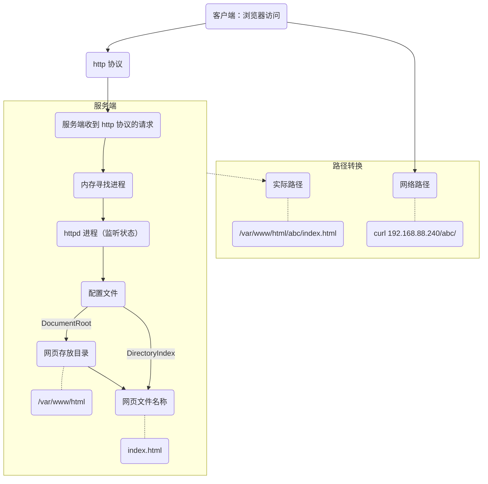

# 系统&服务管理进阶 01

- Web 基础应用
- NFS 服务基础
- 触发挂载（了解）

## HTTP 服务基础

> 推荐文章：[httpd 服务及配置文件详解](https://www.cnblogs.com/luoahong/articles/10559723.html)

- 独立 Web 主机
  - Web 通信基本概念
  - Linux 中的 Web 服务
  - 独立 Web 站点的快速部署
  - 访问 Web 站点
- 虚拟 Web 主机
  - 虚拟主机的含义及类型
  - 配置一个虚拟站点
  - 对默认 Web 站点的影响

### 独立 Web 主机

#### Web 通信基本概念

- 基于 B/S（Browser/Server）架构的网页服务
  - 服务端提供网页
  - 浏览器下载并显示网页
- HTML：**H**yper **T**ext **M**arkup **L**anguage，超文本标记语言
- HTTP：**H**yper **T**ext **T**ransfer **P**rotocol，超文本传输协议


#### Linux 中的 Web 服务

- 软件包：httpd
- 系统服务：httpd
- **常见重点配置：`/etc/httpd/conf/httpd.conf`**
  - Listen：监听地址：端口（==80==）
  - ServerName：本站点注册的 DNS 名称（空缺）
  - DocumentRoot：网页文件根目录（==/var/www/html==）
  - DirectoryIndex：起始页/首页文件名（==index.html==）

##### httpd 的访问控制规则

- ==基于网页文件存放目录，进行访问控制==
- 默认==继承父目录==的访问控制规则
- 默认设置了规则的目录
  - `/`：拒绝所有客户端访问
  - `/var/www`：允许所有客户端访问
  - ……

```xml
<Directory 目录>
    Require all denied/granted #拒绝/允许
</Directory>
```

#### 独立 Web 站点的快速部署

##### 环境准备

- 设置 SELinux 运行模式为 Permissive
  - `setenforce 0`
- 停止防火墙服务
  - `yum -y remove firewalld`

##### 快速部署

1. 装包（httpd）
   `yum -y install httpd`
2. 配置（部署首页 index.html）
   `echo My Web > /var/www/html/index.html`
3. 起服务（httpd）
   `systemctl restart httpd`

###### 服务启动失败的错误查询命令

- `journalctl -xe`

#### 访问 Web 站点

- 为浏览器程序提供 URL 网址
  - **U**niform **R**esouce **L**ocator，统一资源定位器
  - `协议名://服务器地址[:端口号]/目录/文件名`
  
  ```sh
    curl http://192.168.88.1
    
    firefox http://192.168.88.1
  ```

##### 访问出现测试页面原因

1. 没有网页文件
2. 网页名不是 index.html
3. httpd 的访问控制规则拒绝
4. SELinux 没有关闭

#### 扩展

##### 网络路径与实际路径



##### 调用配置文件

- 配置文件
  - `/etc/httpd/conf/httpd.conf` 主配置文件
  - **`/etc/httpd/conf.d/*.conf` 调用配置文件**/分段配置文件
- 一般自定义配置在此文件夹下重新建立

##### Listen：监听IP地址: 监听端口（80）

- 端口：数字编号，起到表示作用，表示协议或进程
- http 协议默认端口：80
- ==建议：自定义端口时大于 1024，端口的极限是 65535==
- 一个协议或进程可以有多个端口，但一个端口只能有一个协议或进程

#### 案例1：独立 Web 站点的快速部署

```sh
# 1.为 http://192.168.88.1 配置 Web 站点
yum -y install httpd
systemctl restart httpd
## 1.1 建立一个主页文件，将其命名为 index.html
vim index.html
## 1.2 将此文件拷贝到站点的 DocumentRoot 目录
mv index.html /var/www/html/

# 2.访问此 Web 站点
## 2.1 使用 elinks 或 curl 浏览上述 Web 站点
curl 192.168.88.1
## 2.2 使用 firefox 浏览上述 Web 站点
firefox 192.168.88.1
```

### 虚拟 Web 主机

#### 虚拟主机的含义及类型

- 虚拟 Web 主机
  - 由同一台服务器提供多个不同的 Web 站点
- 区分方式（构建方式）
  - 基于==域名==的虚拟主机
  - 基于==端口==的虚拟主机
  - 基于 IP 地址的虚拟主机（不建议使用）

#### 配置一个虚拟站点

- 配置文件路径
  - `/etc/httpd/conf/httpd.conf`
  - `/etc/httpd/conf.d/*./conf`
- 为每个虚拟站点添加配置

    ```xml
    <VirtualHost IP地址:端口>
        ServerName 此站点的DNS名称
        DocumentRoot 此站点的网页根目录
    </VirtualHost>
    ```

- 注意事项：
  - 为每个站点提前准备好网页目录

  ```sh
  cd /var/www/virtual/
  echo Web NSD > index.html

  vim /etc/httpd/conf.d/01-www0.conf
  # 写入虚拟站点的配置

  systemctl restart httpd
  ```

##### 补充

- `/etc/hosts`：直接提供域名解析，**只为本机提供**

#### 对默认 Web 站点的影响

- 一旦启用虚拟 Web 主机以后
  - 外部的 DocumentRoot、ServerName 会被忽略
  - 第一个虚拟站点被视为默认站点，若客户机请求的 URL 不属于任何已知站点，则由第一个站点响应
  > [^1]
  > [root@host ~]# vim /etc/httpd/conf.d/00-default.conf
  > <VirtualHost *:80>
  >     ServerName server0.example.com
  >     DocumentRoot /var/www/html
  > \</VirtualHost>
  > [root@host ~]# systemctl restart httpd

[^1]:当独立 Web 服务器升级为虚拟主机服务器后，需要为原 Web 站点建立一个虚拟站点

#### 案例2：虚拟 Web 主机的部署

```sh
# 1.在虚拟机 A 上扩展 Web 站点，创建一个新的虚拟主机 http://www0.example.com

## 1.1 设置 DocumentRoot 为 /var/www/virtual
vim /etc/httpd/conf.d/01-default.conf
#写入如下内容
#<VirtualHost *:80>
#    ServerName www0.example.com
#    DocumentRoot /var/www/virtual
#</VirtualHost>

mkdir /var/www/virtual

## 1.2 建立主页文件，并命名为 index.html，将其放到此虚拟主机的 DocumentRoot 目录下
echo hello > /var/www/virtual/index.html

# 2.确保站点 http://server0.example.com 仍然可用
vim /etc/hosts
#在新的一行 写入如下内容
#IP地址 www0.example.com server0.example.com
```

## NFS 服务基础

- 普通 NFS 服务
  - NFS 共享概述
  - exports 配置文件解析
  - 访问 NFS 共享文件夹

### 普通 NFS 服务

#### NFS 共享概述

- Network File System，网络文件系统
  - 用途：为客户机提供共享使用的文件夹
  - 协议：NFS（TCP/UDP 2049）、RPC（TCP/UDP 111）
- 所需软件包：*`nfs-utils`*
- 系统服务：*`nfs-server`*

#### *exports* 配置文件解析

- 修改 `/etc/exports`
  - `文件夹路径 客户机地址（权限） 客户机地址（权限） ……`
- 使用 `exportfs` 可以重载更新过的配置
  - `exportfs -r`

#### 访问 NFS 共享文件夹

- 列出 NFS 共享资源
  - `showmount -e 服务器地址`
    - `-e` `--export`
- 手动挂载 NFS 共享
  - `mount 服务器地址:文件夹路径 挂载点`
- 开机挂载配置 `/etc/fstab`
  - `服务器地址:文件夹路径 挂载点 nfs _netdev 0 0`
    - `_netdev` 说明：声明网络设备，系统在具备网络参数后，再进行挂载本设备
  - 提供共享的服务器必须在 设置了自动挂载的系统启动 前先启动，否则设置了自动挂载的系统将无法正常启动

#### 案例3：普通 NFS 共享的实现

```sh
# 1.在虚拟机 A 上配置 NFS 服务
## 1.1 只读的方式共享目录 /public
echo '/public *(ro)' >> /etc/exports
systemctl -restart nfs-server

# 2.在虚拟机 B 上访问 NFS 共享目录
## 2.1 将虚拟机 A 的 /public 挂到本地 /mnt/nfsmount
mkdir /mnt/nfsmount
mount 192.168.88.1:/public /mnt/nfsmount/
## 2.2 这些文件系统在系统启动时自动挂载
echo '192.168.88.1:/public /mnt/nfsmount nfs _netdev 0 0' > /etc/fstab
mount -a
```

## 触发挂载（了解）

- autofs 触发挂载
  - 什么是触发挂载
  - autofs 配置解析
- 触发挂载进阶
  - autofs & NFS

### autofs 触发挂载

#### 什么是触发挂载

- 由 *autofs* 服务提供的“按需访问”机制
  - 只要访问挂载点，就会触发响应，自动挂载指定设备
  - 闲置超过时限（默认 5 分钟）后，会自动卸载
  - `rpm -qi autofs`：查看软件信息

#### *autofs* 配置解析

- 主配置文件 `/etc/auto.master`
  - `监控点目录 挂载配置文件的路径`
  - 查看书写格式：`grep -v '^#' /etc/auto.master`
- 挂载配置文件，比如 `/etc/auto.misc`
  - `触发点子目录 -挂载参数 :设备名`
  - 查看书写格式：`grep -v '^#' /etc/auto.misc`

### 触发挂载进阶

#### *autofs* & NFS

- 虚拟机 B 访问 `/myauto/test`，虚拟机 A 的 nfs 共享 `/abc` 挂载到 `/myauto/test`
  > [root@pc2 ~]# `yum  -y  install   autofs`
    [root@pc2 ~]# `vim   /etc/auto.master`
    ……此处省略一万字
    /myauto      /opt/xixi.txt
    ……此处省略一万字
    [root@pc2 ~]# `vim   /opt/xixi.txt`
    nsd    -fstype=iso9660     :/dev/cdrom
    test    -fstype=nfs     192.168.88.240:/abc
    [root@pc2 ~]# `systemctl  restart  autofs`
    [root@pc2 ~]# `ls  /myauto/test`

## 其他

- ssh 协议默认端口为 22
  - 配置文件：`/etc/ssh/sshd_config`
  - 指定端口进行远程管理 `-p`
    - `ssh -p 2244 root@192.168.1.1`
