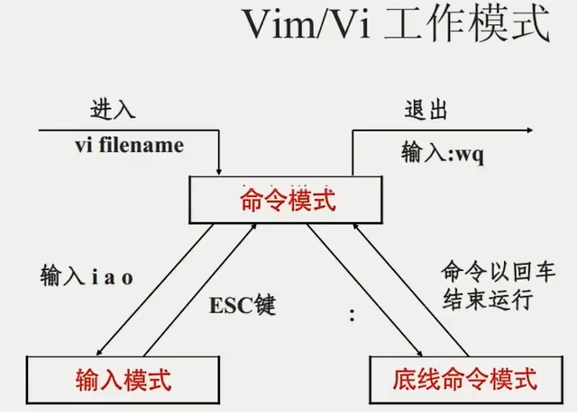

# Linux学习

## 初识Linux

### Linux的诞生

Linux 创始人：林纳斯·托瓦兹

Linux 诞生于1991年，作者上大学期间

因为创始人在上大学期间经常需要浏览新闻和处理邮件，发现现有的操作系统不好用，于是他决心自己写一个保护模式下的操作系统，这就是Linux 的原型，当时他21岁，后来经过全世界网友的支持，现在能够兼容多种硬件，成为最为流行的服务器操作系统之一。

### Linux内核

- Linux 系统内核
- 系统级应用程序

- **内核提供系统最核心的功能**，如：调度CPU、调度内存、调度文件系统、调度网络通讯、调度IO等。
- 系统级应用程序，可以理解为出厂自带程序，可供用户快速上手操作系统，如：文件管理器、任务管理器、图片查看、音乐播放等。

---

可以看出，内核是Linux操作系统最核心的所在，系统级应用程序只是锦上添花。

Linux内核是免费开源的，任何人都可以下载内核源码并查看且修改。

可以通过：<https://www.kernel.org> 去下载Linux内核。

### Linux发行版

内核是免费、开源的，这也就代表了：

- 任何人都可以获得并修改内核，并且自行集成系统级程序

- 提供了内核+系统级程序的完整封装，称之为Linux发行版

---

国内流行：CentOS；国外流行：CentOS、Ubuntu

---

**不同的发行版：**

- **基础命令100%是相同的**
- **部分操作不同（如软件安装）**

### 虚拟机

借助虚拟化技术，可以在系统中，通过软件来模拟计算机硬件并给虚拟硬件安装**真实的操作系统**。

这样，就可以在电脑中，虚拟出一个完整的电脑。

可以通过提供虚拟化的软件来获得虚拟机。

#### 虚拟化软件

---

##### VMware WorkStation

- 下载地址：<https://www.vmware.com/cn/products/workstation-pro.html>

---

###### 打开网络连接页面

- win + r ：输入`ncpa.cpl`

##### 在VMware上安装Linux

---

###### 下载CentOS操作系统

- 首先，需要下载操作系统的安装文件，本次使用Centos7.6版本进行学习：<https://vault.centos.org/7.6.1810/isos/x86_64/> (最后的/不要漏掉)

- 或者直接使用如下链接下载:
  <https://vault.centos.org/7.6.1810/isos/x86_64/CentOS-7-X86_64-DVD-1810.iso>

- **下载不了可以使用磁力链接进行下载**

### 图形化、命令行

对于操作系统的使用，，有两种使用形式：

- 图形化页面使用操作系统
- 以命令的形式使用操作系统

不论是Windows还是Linux亦或是MacOS系统，都支持这两种使用方式。

---

- 图形化：使用操作系统提供的图形化页面，以获得图形化反馈的形式去使用操作系统。
- 命令行：使用操作系统提供的各类命令，以获得字符反馈的形式去使用操作系统。

#### 使用命令行学习Linux系统

尽管图形化是大多数人使用计算机的第一选择，但是在Linux操作系统上，这个选择被反转了。

无论是企业开发亦或是个人开发，使用Linux操作系统，多数都是使用的: 命令行。

---

这是因为：

- Linux从诞生至今，在图形化页面的优化上，并未重点发力。所以Linux操作系统的图形化页面：不好用、不稳定。
- 在开发中，使用命令行形式，效率更高，更加直观，并且资源占用低，程序运行更稳定。

---

- 除了在少数需要做对照讲解的情况下会使用图形化页面

- 其余都会以命令行的形式去讲解Linux操作系统的使用

---

##### FinalShell

我们使用VMware可以得到Linux虚拟机，但是在VMware中操作Linux的命令行页面不太方便，主要是：

- 内容的复制、粘贴跨越VMware不方便
- 文件的上传、下载跨越VMware不方便
- 也就是和Linux系统的各类交互，跨越VMware不方便

---

我们可以通过第三方软件，FinalShell，远程连接到Linux操作系统之上。

并通过FinalShell去操作Linux系统。

这样各类操作都会十分的方便。

---

Finalshell的下载地址为：

Windows：
<http://www.hostbuf.com/downloads/finalshell_install.exe>

Mac：
<http://www.hostbuf.com/downloads/finalshell_install.pkg>

下载完成后双击打开安装。

---

###### FinalShell连接CentOS

- 在CentOS终端输入`ifconfig`获取系统的IP地址

- 在FinalShell中选择SSH连接(Linux)，在主机输入框中输入IP地址

可以在终端和FinalShell中输入`ls`命令来验证是否连接成功

### 拓展：WSL（Windows Subsystem for Linux）

WSL作为Windows10系统带来的全新特性，正在逐步颠覆开发人员既有的选择。

- 传统方式获取Linux操作系统环境，是安装完整的虚拟机，如VMware
- 使用WSL，可以以非常轻量化的方式，得到Linux系统环境

---

目前，开发者正在逐步抛弃以虚拟机的形式获取Linux系统环境，而在逐步拥抱WSL环境。

所以，课程也紧跟当下趋势，为同学们讲解如何使用WSL，简单、快捷的获得Linux系统环境。

所以，为什么要用WSL，其实很简单：

- 开发人员都在用，大家都用的，我们也要学习
- 实在是太方便了，简单、好用、轻量化、省内存

#### 什么是WSL

WSL: Windows Subsystem for Linux，是用于Windows系统之上的Linux子系统。

作用很简单，可以在Windows系统中获得Linux系统环境，并完全直连计算机硬件，无需通过虚拟机虚拟硬件。

---

简而言之：
Windows10的WSL功能，可以无需单独虚拟一套硬件设备
就可以直接使用主机的物理硬件，构建Linux操作系统
并不会影响windows系统本身的运行

#### WSL部署

- WSL是Windows10自带功能，需要开启，无需下载

---

##### 下载Ubuntu

- 在Windows应用商店进行获取和下载

##### 安装Windows Terminal软件

Ubuntu自带的终端窗口软件不太好用，我们可以使用微软推出的：Windows Terminal软件

在应用商店中搜索terminal关键字，找到Windows Terminal软件下载并安装

### 扩展：虚拟机快照

在学习阶段我们无法避免的可能损坏Linux操作系统。

如果损坏的话，重新安装一个Linux操作系统就会十分麻烦。

---

VMware虚拟机（Workstation和Funsion）支持为虚拟机制作快照。

通过快照将当前虚拟机的状态保存下来，在以后可以通过快照恢复虚拟机到保存的状态。

#### 在VMware Workstation Pro中制作并还原快照

- 快照制作时需要确保虚拟机关机（不关机也可以，但是会很慢）

---

---

## Linux基础命令

### Linux的目录结构

Linux 的目录结构是一个树型结构

Windows 系统可以拥有多个盘符，如 C盘、D盘、E盘

Linux 没有盘符这个概念，只有一个根目录 / ，所有文件都在它下面

---

#### Linux路径的描述方式

- 在Linux系统中，路径之间的层级关系，使用：/ 来表示

  `/usr/local/hello.txt`

- 在Windows系统中，路径之间的层级关系，使用：\ 来表示

  `D:\data\work\hello.txt`

### Linux命令入门

#### Linux命令基础

##### 什么是命令、命令行

学习Linux，本质上是学习在命令行下熟练使用Linux的各类命令。

- 命令行：即Linux终端（Terminal），是一种命令提示符页面。以纯“字符”的形式操作系统，可以使用各种字符化命令对系统发出操作指令。

- 命令：即Linux程序。一个命令就是一个Linux的程序。命令没有图形化页面，可以在命令行（终端中）提供字符化的反馈。

##### Linux命令基础格式

无论是什么命令，用于什么用途，在Linux中，命令有其通用的格式：

`command [-options] [parameter]`

- `command`：命令本身
- `-options`：[可选，非必填]命令的一些选项，可以通过选项控制命令的行为细节
- `parameter`：[可选，非必填]命令的参数多数用于命令的指向目标等

---

#### `ls` 命令入门

`ls`（英文**l**i**s**t）命令的作用是列出目录下的内容，语法细节如下：

`ls [-a -l -h] [Linux路径]`

- `-a -l -h` 是**可选**的选项
- Linux路径是此命令**可选**的参数

---

当不使用选项和参数时，直接使用 `ls` 命令本体，表示：以**平铺**形式，列出**当前工作目录**下的内容

##### HOME目录和工作目录

Linux系统的命令行终端，在启动的时候，会默认加载：

- 当前登录用户的HOME目录作为当前工作目录，所以ls命令列出的是HOME目录的内容
- HOME目录：每个Linux操作用户在Linux系统的**个人账户目录**，路径在：/home/用户名

#### `ls` 命令的参数和选项

`ls [-a -l -h] [Linux路径]`

- `-a` 选项，表示：all的意思，即列出全部文件（包含隐藏的文件/文件夹）
  - 以 . 开头的，表示是Linux系统的隐藏文件/文件夹（只要以 . 开头，就能自动隐藏）
  - 只有通过 `-a` 选项，才能看到这些隐藏的文件/文件夹
  - `-A` 选项，不显示 `.` 和 `..`
- `-l` 选项，英文 long，表示：以列表（竖向排列）的形式展示内容，并展示更多信息

---

##### `ls` 命令选项的组合使用

语法中的选项是可以组合使用的，比如学习的 `-a` 和 `-l` 可以组合使用

- `ls -l -a`
- `ls -la`
- `ls -al`

> 除了选项本身可以组合以外，选项和参数也可以一起使用。

---

##### `ls` 命令的 `-h` 选项

- `-h` 表示以易于阅读的形式，列出文件大小，如K、M、G
- `-h` 选项必须要搭配 `-l` 一起使用

---

##### `ls` 命令的其他选项

- `-d`：英文 directory，列出目录本身，而不是其子文件
- `-R`：英文 recursive，递归列出子文件（列出所有文件不仅是子文件）
- `-i`：英文inode，显示每个文件的索引编号（inode 号）

### 目录切换相关命令（`cd`/`pwd`）

#### `cd` 切换工作目录

当Linux终端（命令行）打开时，会默认以用户的HOME目录作为当前的工作目录

可以通过 `cd` 命令，更改当前所在的工作目录。

`cd` 命令来自英文：**C**hange **D**irectory

语法：`cd [Linux路径]`

- `cd` 命令无需选项，只有参数，表示要切换到哪个目录下
- `cd` 命令直接执行，不写参数，表示回到用户的HOME目录

---

#### `pwd` 查看当前工作目录

通过ls来验证当前的工作目录，其实是不恰当的。

我们可以通过 `pwd` 命令，来查看当前所在的工作目录。

pwd命令来自: **P**rint **W**ork **D**irectory

语法: `pwd`

- `pwd` 命令，无选项，无参数，直接输入 `pwd` 即可

### 相对路径、绝对路径和特殊路径符

#### 相对路径和绝对路径

- 绝对路径：以**根目录为起点**，描述路径的一种写法，路径描述以 `/` 开头

- 相对路径：以**当前目录为起点**，描述路径的一种写法，路径描述无需以 `/` 开头

---

#### 特殊路径符

- `.` 表示当前目录， `./Desktop` 和 `Desktop` 效果一致
- `..` 表示上一级目录
- `~` 表示HOME目录， `cd ~/Desktop` 表示切换到HOME内的Desktop目录

### 创建目录命令（`mkdir`）

通过 `mkdir` 命令可以创建新的目录（文件夹）

`mkdir` 来自英文：**M**a**k**e **Dir**ectory

语法：`mkdir [-p] Linux路径`

- 参数**必填**，表示Linux路径，即要创建的文件夹的路径，相对路径或绝对路径均可
- `-p`（英文**p**arent）选项可选，表示自动创建不存在的父目录，适用于创建连续多层级的目录（级联创建目录）

### 文件操作命令part1（`touch`、`cat`、`more`）

#### `touch` 创建文件

可以通过 `touch` 命令创建文件

语法：`touch Linux路径`

- `touch` 命令无选项，参数必填，表示要创建的文件路径，相对、绝对、特殊路径符均可使用
  - `{起始序号..终止序号}`：表示新建多个有递增序号的文件

---

#### `cat` 命令 查看文件内容

准备好文件内容后，可以通过 `cat` 查看内容。

语法：`cat [-n] Linux路径`

- `-n` 选项，英文number，表示显示行号

- `cat` 参数表示：被查看的文件路径，相对、绝对、特殊路径符都可以使用

---

#### `more` 命令查看文件内容

`more` 命令同样可以查看文件内容，同 `cat` 不同的是：

- `cat` 是直接将内容全部显示出来
- `more` 支持翻页，如果文件内容过多，可以一页页的展示

语法：`more Linux路径`

- 同样没有选项，只有必填参数

---

- 在查看的过程中，通过空格翻页
- 通过 q 退出查看

- 按 h 查看帮助信息
- 按回车显示下一行
- 按 b 显示上一页
- ……

### 文件操作命令part2（`cp`、`mv`、`rm`）

#### `cp` 命令 复制文件/文件夹

`cp` 命令可以用于复制文件/文件夹，`cp` 命令来自英文单词：**c**o**p**y

语法：`cp [-r] 参数1 参数2`

- `-r` 选项，可选，用于复制文件夹使用，表示递归
- `参数1`，Linux路径，表示被复制的文件/文件夹
- `参数2`，Linux路径，表示要复制去的地方

---

#### `mv` 移动文件/文件夹

`mv` 命令可以用于移动文件/文件夹，`mv` 命令来自英文单词：**m**o**v**e

语法：`mv 参数1 参数2`

- `参数1`，Linux路径，表示被移动的文件/文件夹
- `参数2`，Linux路径，表示要移动去的地方，如果目标不存在，则进行改名，确保目标存在

---

#### `rm` 删除文件/文件夹

`rm` 命令可用于删除文件/文件夹，`rm` 命令来自英文单词：**r**e**m**ove

语法：`rm [-r -f] 参数1 参数2 …… 参数N`

- 同 `cp` 命令一样， `-r` 选项用于删除文件夹
- `-f` 表示force，强制删除（不会弹出提示确认信息）
  - 普通用户删除内容不会弹出提示，只有root管理员用户删除内容会有提示
    - 可以通过 `su - root` ，并输入密码（和普通用户默认一样）临时切换到root用户
    - 通过输入 `exit` 命令，退回普通用户。
  - 所以一般普通用户用不到 `-f` 选项
- 参数1、参数2、……、参数N 表示要删除的文件或文件夹路径，按照空格隔开

---

##### 通配符

`rm` 命令支持通配符，用来做模糊匹配

- 符号 `*` 表示通配符，即匹配任意内容（包含空）

  如：

  - `test*`，表示匹配任何以test开头的内容
  - `*test`，表示匹配任何以test结尾的内容
  - `*test*`，表示匹配任何包含test的内容

---

- 符号 `?` 表示匹配任意的单个字符

### 查找命令（`which`、`find`）

#### `which` 命令

我们在前面学习的Linux命令，其实它们的本体就是一个个的二进制可执行程序。

和Windows系统中的.exe文件，是一个意思。

我们可以通过 `which` 命令，查看所使用的一系列命令的程序文件存放在哪里。

语法：`which 要查找的命令`

---

#### `find` 命令

##### `find` 命令 - 按文件名查找文件

在Linux系统中，可以通过 `find` 命令去搜索指定的文件。

语法：`find 起始路径 -name "被查找文件名"`

- `find` 命令支持使用通配符来做模糊查询

---

##### `find` 命令 - 按文件大小查找文件

语法：`find 起始路径 -size +|-n[kMG]`

- `+`、`-` 表示大于和小于
- `n` 表示大小数字
- kMG表示大小单位，k（小写字母）表示kb，M表示MB，G表示GB

### `grep`、`wc` 和管道符

#### `grep` 命令

可以通过 `grep` 命令，从文件中通过关键字过滤文件行。

语法：`grep [-n -v -i] 关键字 文件路径`

- 选项 `-n`，可选，表示在结果中显示匹配的行的行号。
- 选项 `-v`，取反，表示不包含该关键字。
- 选项 `-i`，忽略大小写
- 参数：关键字，必填，表示过滤的关键字，带有**空格或其他特殊符号**，建议使用 **“ ”** 将关键字包围起来。
  - 可以使用正则表达式

- 参数：文件路径，必填，表示要过滤内容的文件路径，**可作为内容输入端口**。

---

#### `wc` 命令做数量统计

可以通过 `wc` 命令统计文件的行数、单词数量等

语法：`wc [-c -m -l -w] 文件路径`

- 选项 `-c` ，统计bytes数量
- 选项 `-m` ，统计字符数量
- 选项 `-l` ，统计行数
- 选项 `-w` ，统计单词数量
- 参数 `文件路径` ，被统计的文件，**可作为内容输入端口**

---

#### 管道符： `|`

- 含义：将管道符左边命令的结果，作为右边命令的输入
- 管道符可以嵌套使用

### `echo`、`tail` 和重定向符

#### `echo` 命令

可以使用 `echo` 命令在命令行输出指定内容

语法：`echo 输出的内容`

- 无需选项，只有一个参数，表示要输出的内容

---

#### 反引号 \`

反引号包围的内容，会被作为命令执行，而非普通字符

---

#### 重定向符

- `>` 表示将左侧命令的结果，**覆盖**写入到符号右侧指定的文件中
- `>>` 表示将左侧命令的结果，**追加**写入到符号右侧指定的文件中

---

#### `tail` 命令

使用 `tail` 命令，可以查看文件尾部内容，跟踪文件的最更改

语法：`tail [-f -num] Linux路径`

- 选项 `-f` 表示持续跟踪
- 选项 `-num` 表示查看尾部多少行，不填默认10行

### vi/vim编辑器

vi 是 visual interface 的简称，是 Linux 中最经典的文本编辑器

同图形化界面中的 文本编辑器一样，vi 是命令行下对文本文件进行编辑的绝佳选择。

*vim 是 vi 的加强版本，兼容 vi 的所有指令，不仅能编辑文本，而且还具有 shell 程序编辑的功能，能以不同颜色的字体来辨别语法的正确性，极大方便了程序的设计和编辑性。*

#### vi\vim编辑器的三种工作模式

- 命令模式（Command mode）

  > 命令模式下，所敲的按键编辑器都理解为命令，以命令驱动执行不同的功能。
  >
  > 此模式下，不能自由进行文本编辑。

- 输入模式（Insert mode）

  > 也就是所谓的编辑模式、插入模式。
  >
  > 此模式下，可以对文件内容进行自由编辑。

- 底线命令模式（Last line mode）

  > 以 `:` 开始，通常用于文件的保存、退出。

---

#### 命令模式快捷键

| 模式     | 命令             | 描述                                      |
| -------- | ---------------- | ----------------------------------------- |
| 命令模式 | `i`              | 在当前光标位置进入**输入模式**            |
| 命令模式 | `a`              | 在当前光标位置 *之后* 进入**输入模式**    |
| 命令模式 | `I`              | 在当前行的开头，进入**输入模式**          |
| 命令模式 | `A`              | 在当前行的结尾，进入**输入模式**          |
| 命令模式 | `o`              | 在当前光标下一行进入**输入模式**          |
| 命令模式 | `O`              | 在当前光标上一行进入**输入模式**          |
| 输入模式 | `Esc`            | 在任何情况下数如`Esc`都能回到**命令模式** |
| 命令模式 | `键盘上、键盘k`  | 向上移动光标                              |
| 命令模式 | `键盘下、键盘j`  | 向下移动光标                              |
| 命令模式 | `键盘左、键盘h`  | 向左移动光标                              |
| 命令模式 | `键盘右、键盘l`  | 向右移动光标                              |
| 命令模式 | `0`              | 移动光标到当前行的开头                    |
| 命令模式 | `$`              | 移动光标到当前行的结尾                    |
| 命令模式 | `pageup(PgUp)`   | 向上翻页                                  |
| 命令模式 | `pagedown(PgDn)` | 向下翻页                                  |
| 命令模式 | `/`              | 进入搜索模式                              |
| 命令模式 | `n`              | 向下继续搜索                              |
| 命令模式 | `N`              | 向上继续搜索                              |
| 命令模式 | `dd`             | 删除光标所在行的内容                      |
| 命令模式 | `ndd`            | n 是数字，表示删除当前贯标下 n 行         |
| 命令模式 | `yy`             | 复制当前行                                |
| 命令模式 | `nyy`            | n 是数字，表示复制当前行和下面的 n 行     |
| 命令模式 | `p`              | 粘贴复制的内容                            |
| 命令模式 | `u`              | 撤销修改                                  |
| 命令模式 | `Ctrl+r`         | 反向撤销修改                              |
| 命令模式 | `gg`             | 跳到行首                                  |
| 命令模式 | `G`              | 跳到行尾                                  |
| 命令模式 | `dG`             | 从当前行开始，向下全部删除                |
| 命令模式 | `dgg`            | 从当前行开始，向上全部删除                |
| 命令模式 | `d$`             | 从当前光标开始，删除到本行的末尾          |
| 命令模式 | `d0`             | 从当前光标开始，删除到本行的开头          |

#### 底线命令模式快捷键

| 模式         | 命令        | 描述         |
| ------------ | ----------- | ------------ |
| 底线命令模式 | `:wq`       | 保存并退出   |
| 底线命令模式 | `:q`        | 仅退出       |
| 底线命令模式 | `:q!`       | 强制退出     |
| 底线命令模式 | `:w`        | 仅保存       |
| 底线命令模式 | `:set nu`   | 显示行号     |
| 底线命令模式 | `set paste` | 设置粘贴模式 |

## Linux 用户和权限

### root 用户（超级管理员）

无论是Windows、MacOS、Linux 均采用多用户的管理模式进行权限管理

- 在 Linux 系统中，拥有最大权限的账户名为：root（超级管理员）

root 用户拥有最大的系统操作权限，而普通用户在许多地方的权限是受限的

- **普通用户的权限，一般在其HOME目录内是不受限的**
- **一旦出了HOME目录，大多数地方，普通用户仅有只读和执行权限，无修改权限**

### `su` 和 `exit` 命令

`su` 命令就是用于账户切换的系统命令，其来源英文单词：Switch User
语法：`su [-] [用户名]`

- `-` 符号是可选的，表示是否在切换用户后加载环境变量，==建议带上==
- 参数：用户名，表示要切换的用户，用户名也可以省略，省略时表示切换到 root
- **切换用户后，可以通过 `exit` 命令退回上一个用户，也可以使用快捷键 <kbd>Ctrl</kbd>+<kbd>d</kbd>**
- 使用普通用户，切换到其他用户==需要输入密码==，如切换到 root 用户
- 使用 root 用户切换到其他用户，==无需密码==，可以直接切换

### `sudo` 命令

Linux 中的许多操作需要 root 权限，但长期使用 root 用户，可能会给系统带来损伤（误操作等原因）。
这时就可以使用 sudo 命令，为普通的命令授权，临时以 root 身份执行。

语法：`sudo 其他命令`

- 在其他命令之前，带上 sudo，即可为这一条命令临时赋予 root 授权
- 但是并不是所有的用户，都有权利使用 sudo，**需要为普通用户配置 sudo 认证**

#### 为普通用户配置 sudo 认证

- 切换到 root 用户，执行 visudo 命令，会自动通过 vi 编辑器打开：*/etc/sudoers*
- 在文件的最后添加：
  > user ALL=(ALL)  NOPASSWD: ALL
  - 其中最后的 NOPASSWD:ALL 表示使用 sudo 命令，无需输入密码
- 最后通过 wq 保存
- 切换回普通用户

## Linux其他命令

- `ssh`
  - `netstat -ntlp grep ssh` 查看是否启用了ssh

- `wget -P /etc/yum.repos.d/ http://mirrors.aliyun.com/repo/Centos-7.repo` 下载阿里云软件源的配置信息

- 语法：`rpm [选项] [包的软件名]`
  - 英文：**R**edHat **P**ackage **M**anager
  - `-q`(query)：查询
  - `-a`(all)：查询所有已安装套件
  - `-i`(information)：显示套件的相关信息
    - `-i`(install)：作为主选项时，表示安装
    - `-v`(verboser)：显示指令执行过程
    - `-h`(hash)：软件安装/卸载时列出标记（#）

  - `-e`(erase)：卸载，可以配合 `-v` 和 `-h` 的子选项
  - `-l`(list)：显示软件的安装清单
  - `-f`(file)：查询文件属于哪个软件
  - `-p`(package)：查询未安装的软件包

